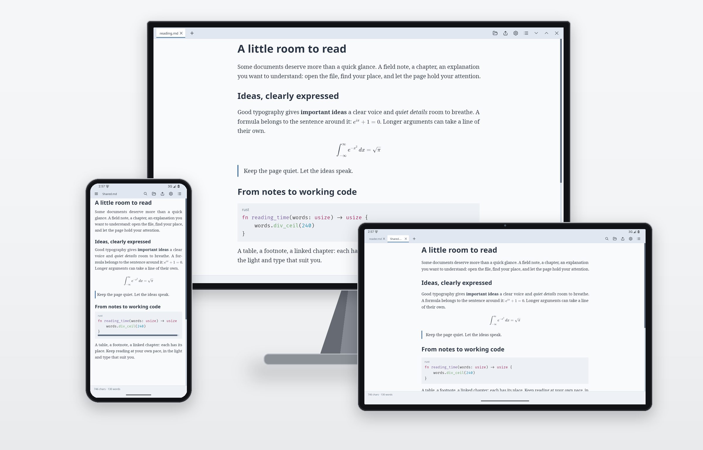
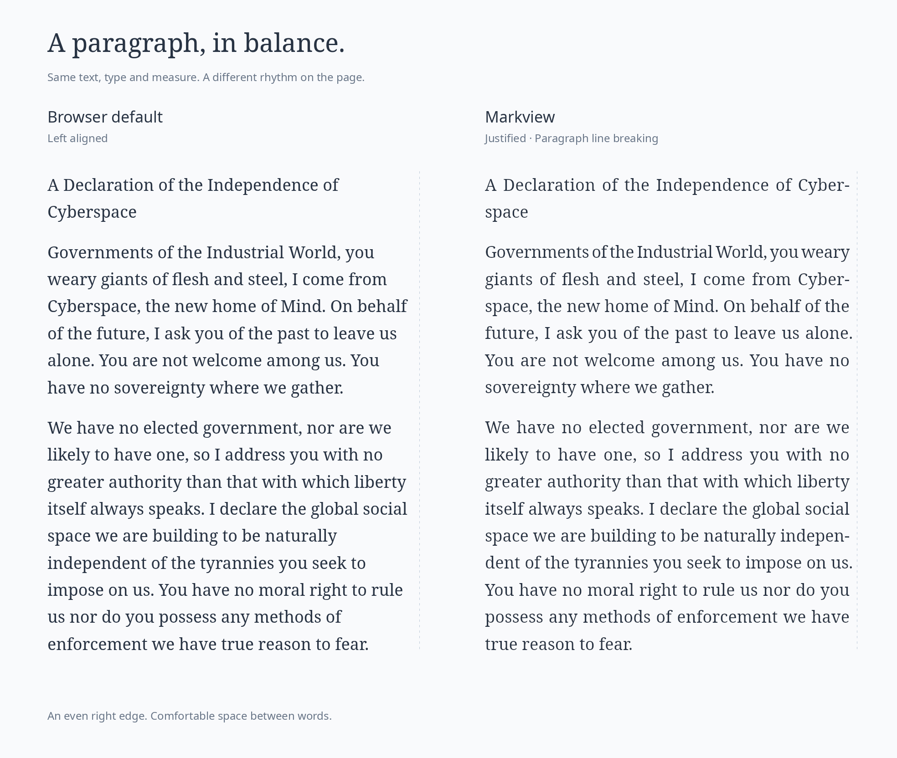
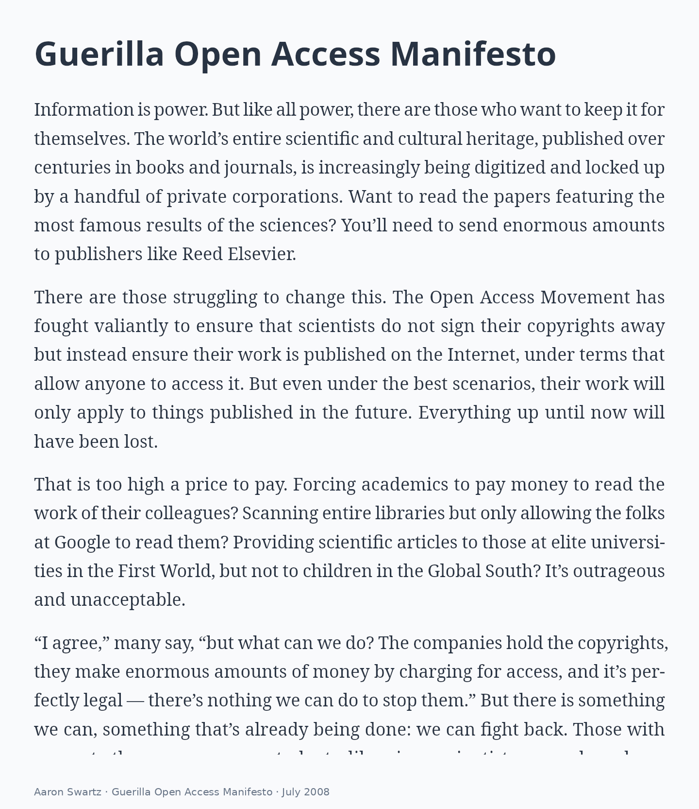
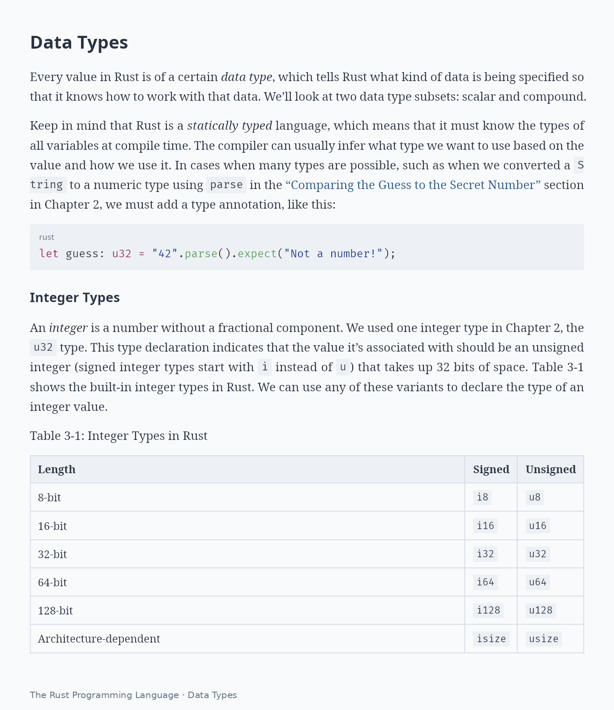
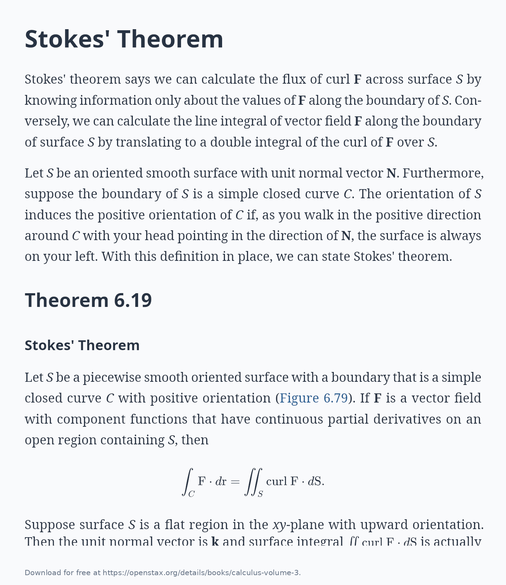
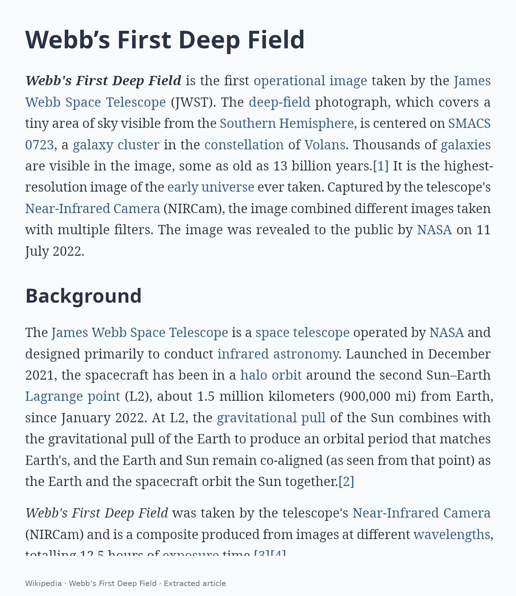
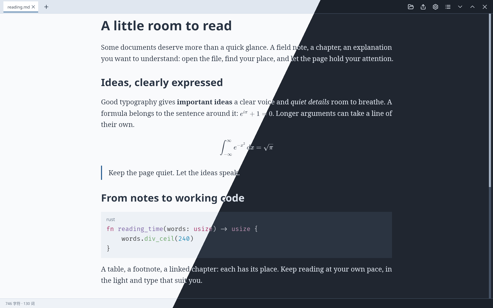
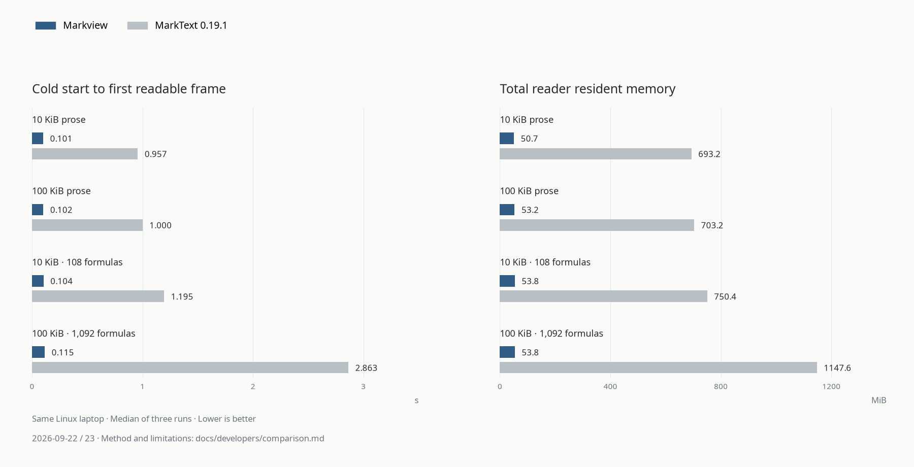

<p align="center">
  
</p>

<h1 align="center">Markview</h1>

<p align="center">
  <strong>Open quickly. Settle into reading.</strong><br>
  A lightweight, native Markdown reader for desktop and Android.<br>
  Clear text, mathematics and code, with publication-quality typography.
</p>

<p align="center">
  <strong><a href="https://github.com/szdytom/markview/releases/latest">Download Markview</a></strong> ·
  <a href="#make-it-your-page">Explore themes</a> ·
  <a href="docs/users/README.md">User guide</a>
</p>

<p align="center">
  English · <a href="README.zh-cn.md">简体中文</a>
</p>

<p align="center">
  
</p>

## Install Now

Choose your platform from the [latest release](https://github.com/szdytom/markview/releases/latest):

| Platform | Download | Getting started |
| --- | --- | --- |
| Windows | `.msi` installer or portable `.zip` | Windows 10+; the installer adds Markdown file associations |
| macOS | Zipped `.app` | Apple Silicon, macOS 11+; see the unsigned-app setup below |
| Linux | `.deb`, AppImage or `.tar.gz` | See the [runtime requirements](docs/users/installation.md#runtime-requirements) |
| Android | `.apk` | Android 9+; ARM64 phones and tablets |

Or install the `markview` command with a script:

**Linux / macOS — Shell**

```sh
curl --proto '=https' --tlsv1.2 -LsSf \
  https://github.com/szdytom/markview/releases/latest/download/markview-installer.sh | sh
```

**Windows — PowerShell**

```powershell
irm https://github.com/szdytom/markview/releases/latest/download/markview-installer.ps1 | iex
```

**Arch Linux — [AUR](https://aur.archlinux.org/packages/markview-bin)**

```sh
yay -S markview-bin
```

The AUR also offers a [source build](https://aur.archlinux.org/packages/markview).

**Desktop:** open a Markdown file, or choose Markview from **Open with**.
**Android:** open or share a document to **Read in Markview**. Import its folder
when you want to read linked chapters and local images together.

The macOS app is unsigned. After moving it to Applications, run:

```sh
xattr -d com.apple.quarantine /Applications/Markview.app
```

[Full installation guide](docs/users/installation.md) · [Android guide](docs/users/android.md)

## Typography that keeps the page in balance

An even right edge, without distracting gaps between words. Markview breaks
lines across the whole paragraph and hyphenates English words to balance the
text. Below, the same passage uses the same font, size and column width in a
browser's default left-aligned layout and Markview's justified layout.

<p align="center">
  
</p>

[How this comparison is rendered](docs/developers/comparison.md#the-figure)
· Text: [A Declaration of the Independence of Cyberspace](https://www.eff.org/cyberspace-independence), John Perry Barlow.

Careful CJK punctuation and native LaTeX keep text and mathematics readable,
with no separate TeX installation. Tables, highlighted code, footnotes, GitHub alerts, images and Mermaid diagrams
belong on the same page. Markdown is rendered directly to the screen, without a
browser or WebView. The native app is read-only: your source stays yours.

## Read across different kinds of documents

Long-form articles, technical manuals, mathematics—and web articles brought
into the native reader. These previews come from real documents.

| Long-form reading · Paragraphs and rhythm | Technical documents · Code, links and tables |
| --- | --- |
|  |  |
| [Guerilla Open Access Manifesto](https://archive.org/details/GuerillaOpenAccessManifesto) · Aaron Swartz, July 2008 | [The Rust Programming Language](https://doc.rust-lang.org/book/ch03-02-data-types.html) · Data Types |

| Mathematics · Theorems and formulas | Web articles · Focus on the text |
| --- | --- |
|  |  |
| [OpenStax Calculus Volume 3](https://openstax.org/books/calculus-volume-3/pages/6-7-stokes-theorem) · §6.7 Stokes’ Theorem | [Wikipedia: Webb’s First Deep Field](https://en.wikipedia.org/wiki/Webb%27s_First_Deep_Field) |

[Excerpts, translations and image credits](docs/screenshots/source/showcase/README.md).
Web reading is experimental.

## Make it your page

Choose a quiet light theme, a dark reading surface, or a little more character.
Light and Dark share the same page layout, joined along a single diagonal below.

<p align="center">
  
</p>

Adjust fonts and text size, or customize line spacing and more with an MVSS theme.
Themes and font settings are available on desktop and Android.
[Explore the theme gallery](docs/users/themes.md) · [Reading settings](docs/users/settings.md) · [Theme guide](docs/users/stylesheets.md)

## Keep your place

- **Find what matters.** Search within a document or jump through its contents.
- **Read across chapters.** Follow Markdown links in tabs and return to saved reading positions.
- **Take something with you.** Copy text, code or formulas; export to PDF or PNG.
- **Read on your phone or tablet.** Android shares the native typesetting and themes, with touch scrolling, a phone tab drawer and tablet tabs.
- **Stay up to date.** Desktop file watching refreshes an open document after changes; on Android, reopen a file or folder to import changes.

Experimental web reading can also open static articles in native reader tabs.
See the [reading guide](docs/users/reading.md) for controls and supported content.

## Publication-quality PDF export

Take the typography with you. Native PDF export preserves carefully set
paragraphs, mathematics and highlighted code, with thoughtful page breaks.
Choose paper size, margins and a print theme; add headers, footers and page
numbers. Text stays selectable, and links remain clickable.

Press **Ctrl+E** on desktop, or run `markview pdf document.md -o document.pdf`.
[PDF and image export guide](docs/users/export.md)

## Security taken seriously

Opening a document should be a routine act. Markview treats document content as
untrusted and publishes the boundaries behind its protections.

- **An explicit threat model.** Documents cannot execute scripts. Resource budgets limit expensive processing, and potentially executable local link targets require confirmation. The [threat model](docs/developers/security.md) explains filesystem, network and OS-handler policies, along with their limits.
- **Fuzzing beyond crashes.** Fifteen libFuzzer targets exercise parsing, incremental updates, layout, mathematics, fonts and PDF export, with structured mutations, differential checks and per-input time and allocation budgets. The [fuzzing framework](fuzz/README.md) documents coverage and reproducible campaigns; [verification status](docs/developers/security-verification.md) records remaining gaps.
- **Fixes that reach upstream.** Markview's fuzzing has helped find and fix multiple defects in Comrak, its Markdown parser. Merged fixes include [multiline inline source positions](https://github.com/kivikakk/comrak/pull/855), [front-matter carriage returns](https://github.com/kivikakk/comrak/pull/861) and [paragraph ranges before CRLF tables](https://github.com/kivikakk/comrak/pull/864).

To report a vulnerability privately, use [GitHub Security Advisories](https://github.com/szdytom/markview/security/advisories/new).

## Lightweight, with measurements to match

| Measure | Recorded result |
| --- | --- |
| First readable GPU frame | About **100 ms**, from a 10 KiB note to a 1 MiB document |
| Resident memory | About **50 MiB** for an ordinary note |
| Release downloads | **Under 20 MB**, including the Android APK, in v0.2.0 |

<p align="center">
  <a href="docs/developers/comparison.md"></a>
</p>

The comparison shows cold starts and total reader-process RSS for four fixtures,
using medians of three runs on the same Linux laptop on September 22–23, 2026.
MarkText is an editor with a preview; this comparison measures document reading.

Latency and memory are recorded Linux desktop measurements from an Intel Core
Ultra 5 125H laptop with integrated Intel Arc, Vulkan and the `performance`
power profile. First-frame timing includes process startup and initialization,
but excludes compositor presentation. Results vary with hardware, fonts and
power settings; these figures are not Android benchmarks.

[Measurement method and baselines](docs/developers/performance.md#native-baseline-on-the-performance-profile) ·
[Reader and PDF comparisons](docs/developers/comparison.md) ·
[v0.2.0 downloads](https://github.com/szdytom/markview/releases/tag/v0.2.0)

## Documentation and contributing

[User guides](docs/users/README.md) · [Android](docs/users/android.md) ·
[Build and contribute](CONTRIBUTING.md) · [Developer guides](docs/developers/README.md)

For embedding in a web application, the separate [Web/TypeScript components](docs/library/README.md)
provide a WASM viewer and CodeMirror split editor.

Markview is open source under the [MIT license](LICENSE).
[Third-party notices](THIRD_PARTY.md) · [All documentation](docs/README.md)
