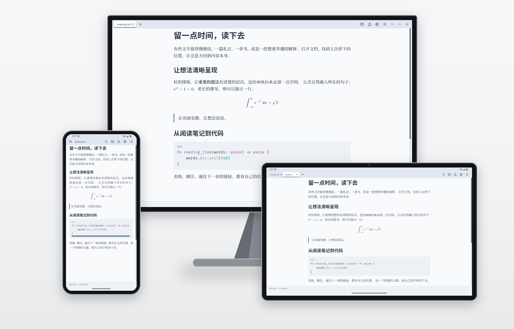
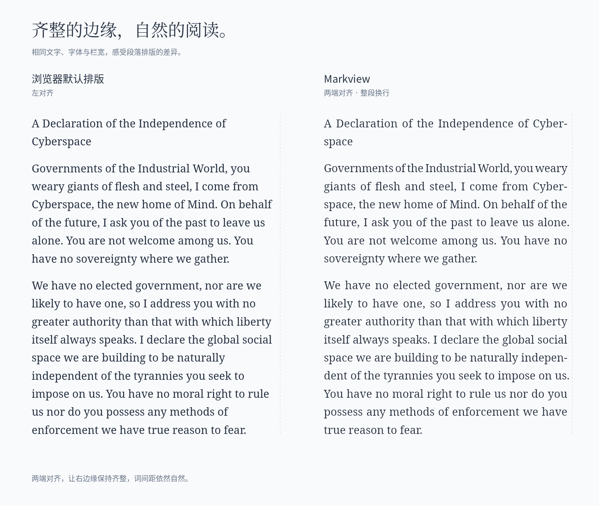
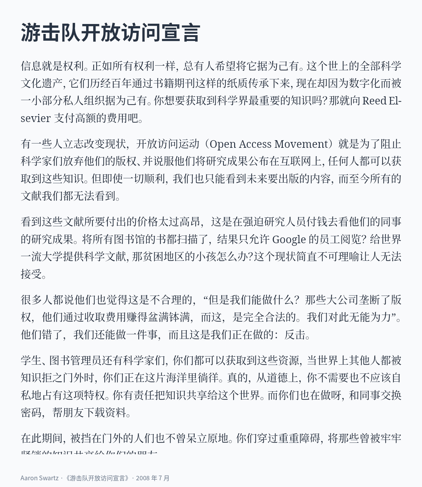
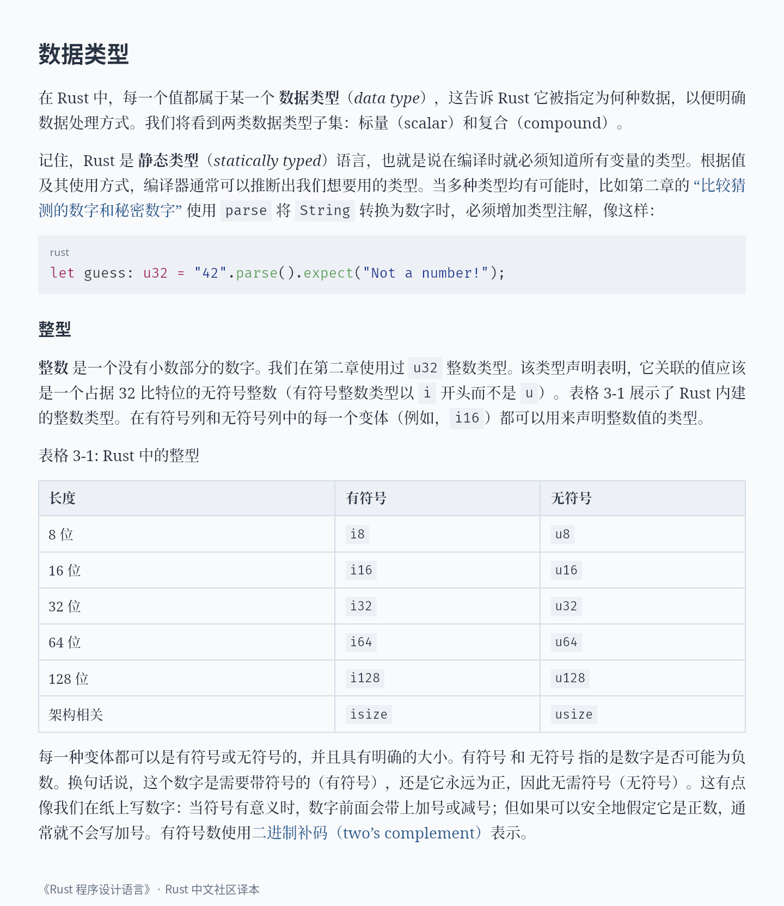
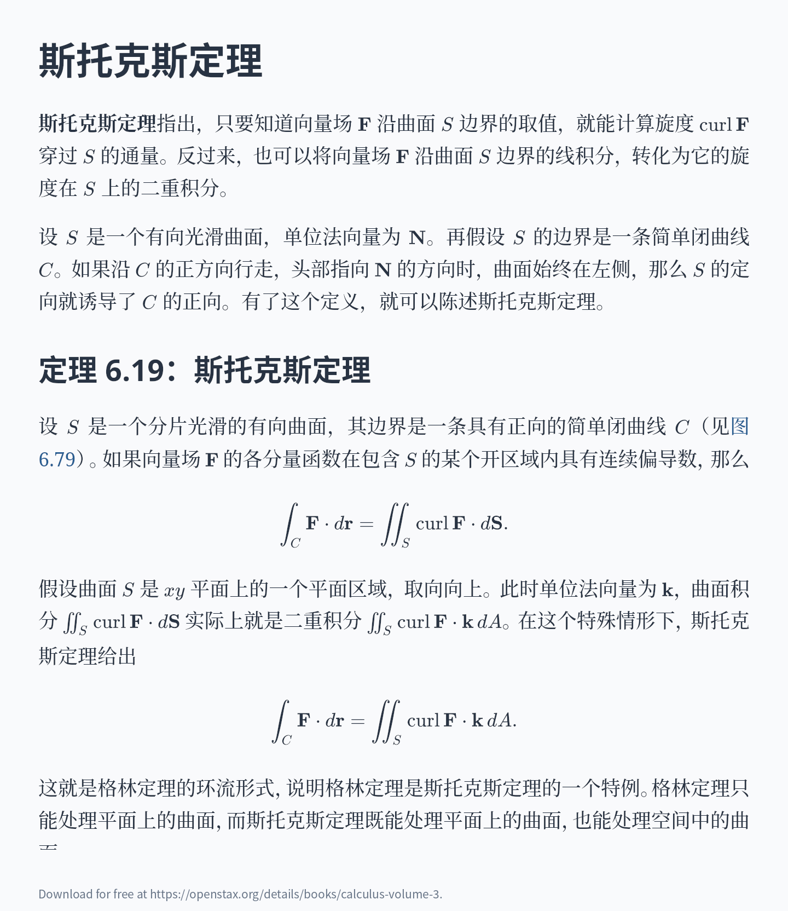
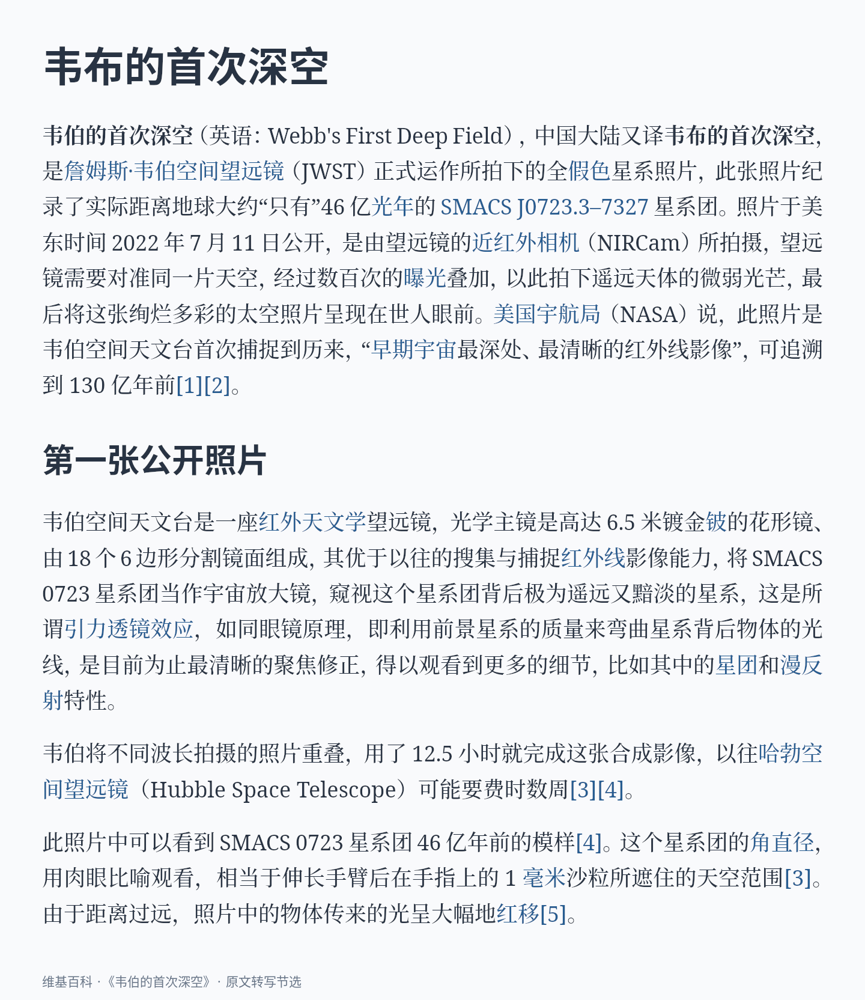
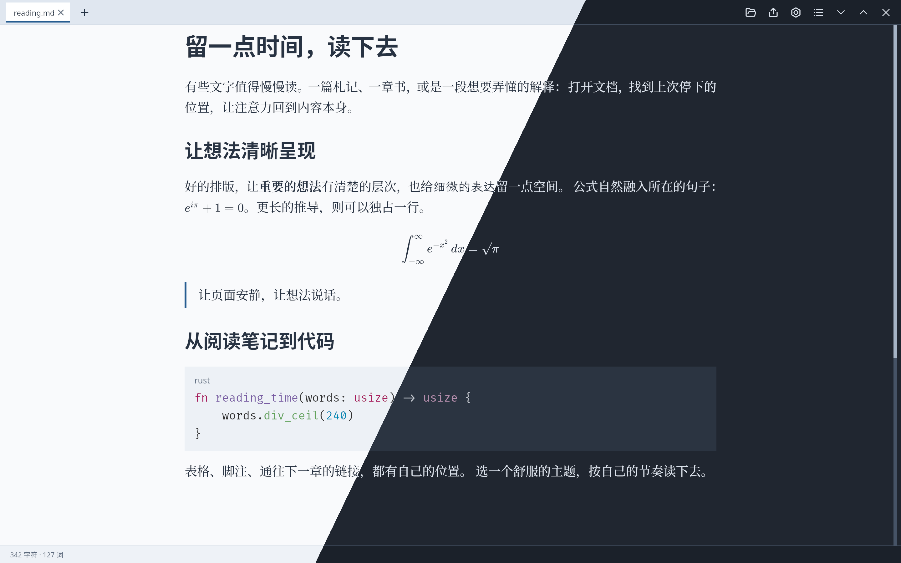
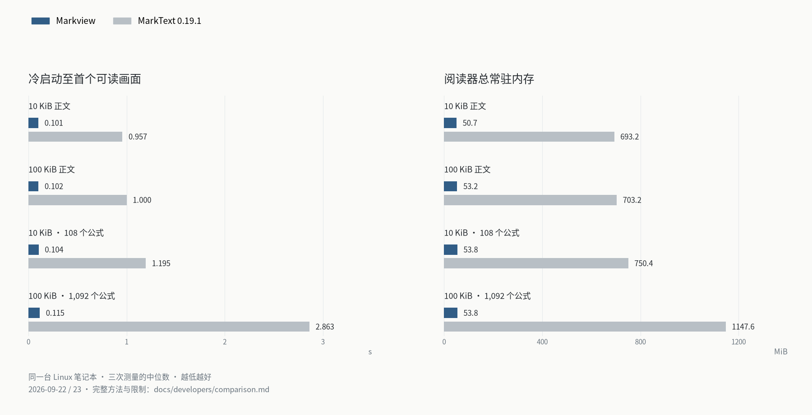

<p align="center">
  
</p>

<h1 align="center">Markview</h1>

<p align="center">
  <strong>轻快打开，安心阅读。</strong><br>
  适用于桌面与 Android 的轻巧原生 Markdown 阅读器。<br>
  正文、公式与代码清晰呈现，排版质量达到出版级。
</p>

<p align="center">
  <strong><a href="https://github.com/szdytom/markview/releases/latest">下载 Markview</a></strong> ·
  <a href="#读出自己的风格">浏览主题</a> ·
  <a href="docs/users/guide.zh-cn.md">使用指南</a> ·
  <a href="https://qm.qq.com/q/hMYoLidy0w">加入 QQ 群</a>
</p>

<p align="center">
  <a href="README.md">English</a> · 简体中文
</p>

<p align="center">
  
</p>

## 立即安装

从[最新版本](https://github.com/szdytom/markview/releases/latest)选择适合你的安装包：

| 平台 | 下载格式 | 安装说明 |
| --- | --- | --- |
| Windows | `.msi` 安装包或便携 `.zip` | Windows 10+；安装包添加 Markdown 文件关联 |
| macOS | 打包为 zip 的 `.app` | Apple Silicon、macOS 11+；未签名应用的设置见下方 |
| Linux | `.deb`、AppImage 或 `.tar.gz` | 请查看[运行要求](docs/users/installation.md#runtime-requirements) |
| Android | `.apk` | Android 9+；ARM64 手机与平板 |

也可以通过脚本安装 `markview` 命令：

**Linux / macOS — Shell**

```sh
curl --proto '=https' --tlsv1.2 -LsSf \
  https://github.com/szdytom/markview/releases/latest/download/markview-installer.sh | sh
```

**Windows — PowerShell**

```powershell
irm https://github.com/szdytom/markview/releases/latest/download/markview-installer.ps1 | iex
```

**Arch Linux — [AUR](https://aur.archlinux.org/packages/markview-bin)**

```sh
yay -S markview-bin
```

AUR 也提供[源码构建包](https://aur.archlinux.org/packages/markview)。

**桌面版：**打开 Markdown 文件，或在**打开方式**中选择 Markview。
**Android：**打开或分享文档时选择**在 Markview 中阅读**。如果文档包含本地图片或相邻章节，请导入所在文件夹。

macOS 应用未签名。将它移入“应用程序”后，运行：

```sh
xattr -d com.apple.quarantine /Applications/Markview.app
```

[完整安装指南](docs/users/installation.md) · [Android 使用指南](docs/users/android.md)

## 齐整的右边缘，均衡的段落

让正文的右边缘齐整，也让词间距保持自然。
Markview 从整个段落安排换行，结合英文断字，平衡每一行的文字。
下图用相同的文字、字体、字号和栏宽，对比浏览器默认的左对齐与 Markview 的两端对齐。

<p align="center">
  
</p>

[对比图的渲染方法](docs/developers/comparison.md#the-figure)
· 选文：[《网络空间独立宣言》](https://www.eff.org/cyberspace-independence)，John Perry Barlow。

细致的中文标点处理与原生 LaTeX，让正文和公式自然融为一体，无须另行安装 TeX。
表格、语法高亮代码、脚注、GitHub 提示块、图片与 Mermaid 图表，都在同一页上清晰呈现。
Markdown 直接渲染到屏幕，不依赖浏览器或 WebView。原生应用只读，源文件始终由你掌握。

## 阅读不同的内容

从长篇文章、技术手册到数学教材，也可以把网页转写成适合阅读的正文。
以下展示选自真实文档，中文版使用中文原文、已有译本或注明来源的节选译文。

| 普通长文 · 段落与阅读节奏 | 技术文档 · 代码、链接与表格 |
| --- | --- |
|  |  |
| [《游击队开放访问宣言》](https://archive.org/details/GuerillaOpenAccessManifesto) · Aaron Swartz · 2008 年 7 月 | [《Rust 程序设计语言》](https://kaisery.github.io/trpl-zh-cn/ch03-02-data-types.html) · 数据类型 |

| 数学文档 · 定理与公式 | 网页转写 · 专注文章本身 |
| --- | --- |
|  |  |
| [OpenStax《微积分》第三卷](https://openstax.org/books/calculus-volume-3/pages/6-7-stokes-theorem) · 6.7 斯托克斯定理节选译文 | [维基百科《韦伯的首次深空》](https://zh.wikipedia.org/wiki/%E9%9F%8B%E4%BC%AF%E7%9A%84%E9%A6%96%E6%AC%A1%E6%B7%B1%E7%A9%BA) · 简体页面 |

[选段、翻译与图片来源](docs/screenshots/source/showcase/README.md)。
网页阅读目前为实验性功能。

## 读出自己的风格

明亮或沉静，由你选择。下图沿一条斜线拼接 Light 与 Dark，两种主题保留相同的页面布局。

<p align="center">
  
</p>

调整字体与字号，也可以用 MVSS 定制行距、创建自己的主题。
桌面与 Android 均支持主题和字体设置。
[浏览完整主题展示](docs/users/themes.md) · [阅读设置](docs/users/settings.md) · [主题指南](docs/users/stylesheets.md)

## 顺着自己的节奏读

- **找到重点。**搜索文档内容，或通过目录直达章节。
- **连着读下去。**在标签页中打开 Markdown 链接，回到保存的阅读位置。
- **带走需要的内容。**复制正文、代码与公式，或导出 PDF、PNG。
- **在手机与平板上阅读。**Android 共享原生排版与主题，支持触摸滚动、手机标签抽屉和平板标签栏。
- **跟上文件变化。**桌面版监视并刷新已打开的文件；Android 重新打开文件或文件夹即可导入更新。

实验性网页阅读也可以将静态文章打开为原生阅读标签页。
操作方式与支持的内容见[中文使用指南](docs/users/guide.zh-cn.md)。

## 高质量 PDF 导出

把精心排版的页面带走。原生 PDF 导出保留正文、公式与代码高亮，妥善处理分页。
可以选择纸张大小、页边距与打印主题，添加页眉、页脚和页码。
导出后文字仍可选取，链接仍可点击。

桌面版按 **Ctrl+E**，或运行 `markview pdf document.md -o document.pdf`。
[PDF 与图片导出指南](docs/users/export.md)

## 认真对待每一份文档的安全

打开文档应该是一件平常的事。Markview 将文档内容视为不可信输入，并公开防护措施背后的边界。

- **明确的威胁模型。**文档无法执行脚本；资源预算限制昂贵的处理工作，可能执行程序的本地链接目标需要确认。[威胁模型](docs/developers/security.md)说明文件系统、网络与系统处理程序的策略，以及防护的适用范围。
- **不止检查崩溃的模糊测试。**15 个 libFuzzer 目标覆盖解析、增量更新、排版、公式、字体与 PDF 导出，结合结构化变异、差分检查，以及每次输入的时间和内存分配预算。[fuzz 框架](fuzz/README.md)记录覆盖范围与可复现的测试流程，[验证状态](docs/developers/security-verification.md)公开尚待补齐的部分。
- **推动上游一起修复。**Markview 的模糊测试帮助发现并修复了 Markdown 解析库 Comrak 的多项缺陷。已合并的修复包括[多行行内元素的源位置](https://github.com/kivikakk/comrak/pull/855)、[front matter 中的回车换行处理](https://github.com/kivikakk/comrak/pull/861)和 [CRLF 表格前的段落范围](https://github.com/kivikakk/comrak/pull/864)。

发现安全漏洞时，请通过 [GitHub Security Advisories](https://github.com/szdytom/markview/security/advisories/new) 私下报告。

## 轻巧，也有实测依据

| 项目 | 已记录的结果 |
| --- | --- |
| 首个可读 GPU 帧 | 约 **100 ms**，从 10 KiB 笔记到 1 MiB 文档 |
| 常驻内存 | 普通笔记约 **50 MiB** |
| 发布包下载体积 | v0.2.0 **小于 20 MB**，包括 Android APK |

<p align="center">
  <a href="docs/developers/comparison.md"></a>
</p>

对比图展示四份测试文档的冷启动耗时与阅读器进程总常驻内存，取三次测量的中位数，
于 2026 年 9 月 22–23 日在同一台 Linux 笔记本上测量。
MarkText 是带预览的编辑器；这里对比的是打开并阅读文档的表现。

延迟与内存数据来自 Linux 桌面实测：Intel Core Ultra 5 125H 笔记本、Intel Arc 核显、Vulkan、`performance` 电源模式。
首帧计时包含进程启动与初始化，不含桌面合成器呈现时间。
硬件、字体与电源设置会影响结果；上述性能数字不代表 Android 测试结果。

[测量方法与完整基线](docs/developers/performance.md#native-baseline-on-the-performance-profile) ·
[阅读器与 PDF 导出对比](docs/developers/comparison.md) ·
[v0.2.0 发布包](https://github.com/szdytom/markview/releases/tag/v0.2.0)

## 文档与贡献

[中文使用指南](docs/users/guide.zh-cn.md) · [Android](docs/users/android.md) ·
[构建与贡献](CONTRIBUTING.md) · [开发者文档](docs/developers/README.md)

如果你希望嵌入网页，独立的 [Web/TypeScript 组件](docs/library/README.md)提供 WASM 阅读器与 CodeMirror 分屏编辑器。

Markview 以 [MIT 许可证](LICENSE)开源。
[第三方声明](THIRD_PARTY.md) · [完整文档导航](docs/README.md)

## 交流与反馈

欢迎加入 [Markview QQ 群](https://qm.qq.com/q/hMYoLidy0w)，交流阅读体验、分享主题与反馈问题。
群号：**584396685**。
