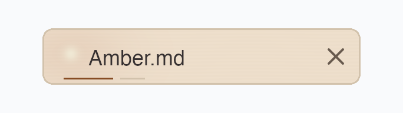

# Color fields

`markview_core::image::ColorField` paints a component using a Rust function
`color(x, y) -> Color`. Both coordinates run from zero to one across the
component, independently of its position and aspect ratio. The function is
sampled at pixel centers; its output is straight-alpha sRGB RGBA8.

```rust
use std::num::NonZeroU32;
use markview_core::image::ColorField;
use markview_core::style::Color;

let field = ColorField::rasterize(
    [NonZeroU32::new(180).unwrap(), NonZeroU32::new(32).unwrap()],
    |x, y| {
        let light = (-40.0 * ((x - 0.1).powi(2) + (y - 0.5).powi(2))).exp();
        let red = (220.0 + 20.0 * light) as u32;
        Color((red << 24) | 0x00E0CDFF)
    },
);
let draw = field.draw(rect, "ui:amber-tab", revision, &mut snapshot.images);
```

For multiple functions, start a transparent canvas and call `paint` repeatedly.
Later layers cover earlier ones using source-over in linear light, matching the
native renderer. Each layer returns straight-alpha sRGB `Color`; zero alpha
leaves the previous result unchanged. `map` also receives the current color,
so it can transform the accumulated result or apply a mask:

```rust
let field = ColorField::builder(size)
    .paint(|_, _| Color(0xEFE0CDFF)) // Buttercream base.
    .paint(|x, y| warm_light(x, y))
    .paint(|x, y| wood_grain(x, y))
    .map(|x, y, color| rounded_mask(x, y, color))
    .finish();
```

Callbacks run immediately, once per pixel per call, and can borrow local state;
they are never retained or executed during a repaint. All layers share one
working canvas and flatten into one final resource, so layer count does not
increase GPU textures or draw calls. Layer results are quantized to RGBA8;
use one callback when a calculation needs greater intermediate precision.
`rasterize` is the single-function convenience form of `builder` plus `map`.

Choose bounded **physical pixel** dimensions. A 180 × 32 logical-pixel tab at
2× scale needs 360 × 64 samples; distances inside the function may account for
the component's aspect ratio. Alpha can describe soft edges or a rounded mask.

Rasterization happens once when the field is created. Fully transparent fields
become an invisible rectangle, and uniform fields become a solid rectangle;
neither retains a pixel buffer or uploads a texture. Other fields retain one
shared pixel buffer and use the existing versioned image texture cache. A
180 × 32 field uses 23,040 bytes of pixels, plus the GPU copy when displayed.

Keep the field and its draw instructions for ordinary repaints and movement.
Rebuild when physical dimensions, palette, or function parameters change, and
give the replacement a new `revision`. The source ID must be unique to the
component's generated resource. Cloned fields share CPU pixels; draws using
the same source ID and revision also share the GPU texture. Different source
IDs create separate GPU textures. Removing its metadata releases the GPU texture
on the next render; call `snapshot.images.pixels.remove(source, revision)` to
release the corresponding CPU residency. Replacing a field through `draw`
automatically retires its previous version.

## Native Amber tab example

This example uses a Buttercream base, faint Frosted Almond grain, a Caramel glow,
and a Sweet Cream light spot. Four `paint` calls build the material; a final
`map` applies an antialiased rounded mask to the accumulated color. The label,
close icon, border, and two fine lines use ordinary native draws.



The image above is the actual Metal renderer output at 3× scale. It is an
isolated 180 × 32 logical-pixel tab specimen. The color field occupies its
178 × 30 interior; the component's border remains a separate native draw.
See [`examples/amber-tab.rs`](../../examples/amber-tab.rs) for the complete runnable
example, including the `with_alpha` and `rounded_alpha` helpers:

```rust
let field = ColorField::builder([
    NonZeroU32::new((178.0 * scale).ceil() as u32).unwrap(),
    NonZeroU32::new((30.0 * scale).ceil() as u32).unwrap(),
])
.paint(|_, _| Color(0xEFE0CDFF))
.paint(|x, y| {
    let grain = (y * 96.0 + (x * 12.0).sin() * 0.7).sin() * 0.5 + 0.5;
    with_alpha(Color(0xD2C2ACFF), 0.04 + 0.08 * grain)
})
.paint(|x, y| {
    let glow = (-((x - 0.085) / 0.18).powi(2)
        - ((y - 0.45) / 0.7).powi(2)).exp();
    with_alpha(Color(0xC37C54FF), glow * 0.16)
})
.paint(|x, y| {
    let light = (-((x - 0.085) / 0.022).powi(2)
        - ((y - 0.45) / 0.13).powi(2)).exp();
    with_alpha(Color(0xF0EAD6FF), light * 0.9)
})
.map(|x, y, color| with_alpha(color, rounded_alpha(x, y, scale)))
.finish();
```

Render the 1×, 1.25×, and 3× PNGs into `artifacts/amber-tabs` with:

```sh
cargo run --release --example amber-tab
```

The example also repaints each result 100 times and asserts that GPU memory
stays constant. To reproduce the committed screenshot, copy
`artifacts/amber-tabs/amber-field-3x.png` to
`docs/screenshots/amber-tab-color-field.png`. Text uses host fonts, so its glyphs
can vary between machines.

This is a Rust drawing API. MVSS remains declarative and does not execute color
functions; the example uses MVSS only for its panel palette.
