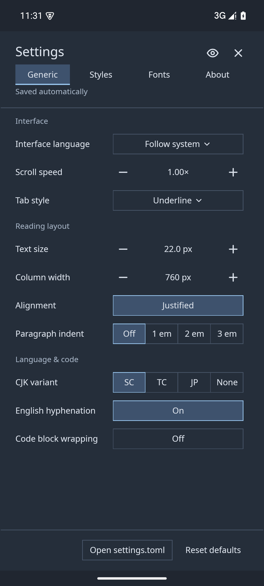
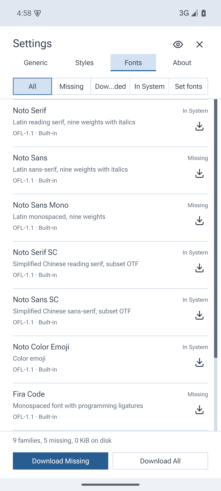
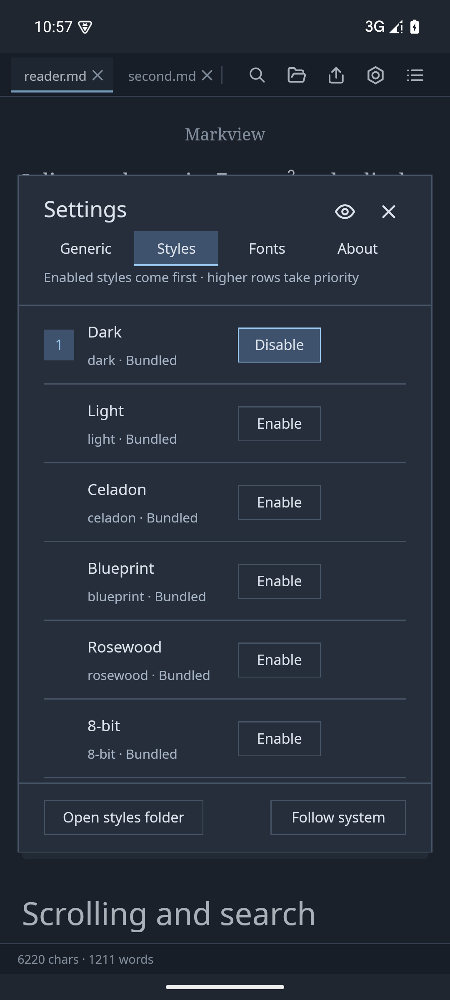
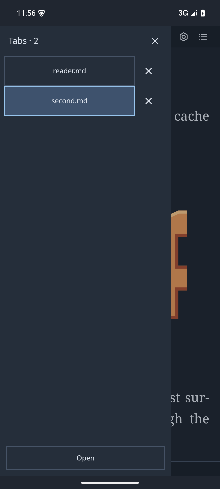

# Android reading

[User documentation](README.md) · [Documentation](../README.md)

Markview for Android supports Android 9 (API 28) and newer. Download the APK
from [Releases](https://github.com/szdytom/markview/releases). The app uses the
same native typography, settings, fonts, themes and image cache as the desktop reader.

## Read and customize

Tap **Open** to choose a file or a folder. Folder imports preserve relative
images and Markdown links; `README.md` is preferred as the first document.
Android's **Open with** and **Share** offer **Read in Markview** (localized to
**在 Markview 中阅读** in Simplified Chinese), opening the supplied file directly
without first saving it or finding it in the picker. Markdown MIME types, plain
text and generic `application/octet-stream` attachments are supported, including
providers whose content URIs do not contain a filename. Generic attachments can
also list Markview for non-Markdown files because Android cannot filter shares
by their display filename. Shared text opens as a Markdown document.
Tabs, touch scrolling, outline, search,
settings and styles use the same controllers as the desktop reader. Phones open
the tab drawer with the top-left menu button or a right swipe across the reader.
Selecting a tab, tapping the outside scrim or pressing Back dismisses the tab
drawer. A left swipe opens right-side Contents on phones and tablets, including
while the tab drawer is open. Back closes
the open search or panel before returning the task to the background.

Settings, downloaded fonts, styles and image cache live under the private app
files directory in `markview/`. Android settings omit the desktop buttons for
opening `settings.toml`, the fonts folder and the styles folder. Downloaded
fonts use the existing catalogue and font-family selectors.
Export uses Android's system save dialog and passes the written result to an
installed viewer. Repeated watched exports update the selected destination.

Documents are imported copies. Reopen a file or folder to import external
changes. Reimporting a folder removes files deleted at the source and retains
the previous copy if importing fails. Tabs survive rotations and activity
suspension; saved tabs and reading positions are restored after activity
destruction or a process restart. Folder imports copy
the chosen tree, so choose the document's own folder rather than a large
archive. Android limits access to sibling files when only one file is granted;
use folder import for local images and neighbouring Markdown files.

## Phone and tablet controls

Below 640 logical pixels,
settings occupy the entire app content area; wider screens retain the centered dialog. Narrow forms stack labels above
controls. The device's smallest width selects phone or tablet mode:

| Device configuration | Tab management | Orientation | Tab-style setting |
|---|---|---|---|
| Smallest width below 600 dp | Left drawer: switch, close and open documents | Portrait | Hidden and ignored |
| Smallest width at least 600 dp | Shared desktop tab strip | Portrait or landscape | Available |

Phone mode fills the available reading width with 20 logical pixels of margin
on each side and hides the column-width setting; tablets retain adjustable
columns. Scroll speed is hidden on all Android devices because it does not
change touch scrolling.

**About** and **Copy diagnostics** include one mobile-mode line, such as
`Mobile Mode: Phone (411 dp)` or `Mobile Mode: Tablet (800 dp)`.

The device mode follows the smallest width, independent of rotation and keyboard
visibility; configuration changes update it without discarding reader sessions. Desktop window-layout and single-instance settings are hidden and
ignored on Android. Browsing sessions are
retained by default, and the desktop session-restore setting is hidden. System bars and
the keyboard are excluded from the reader's content area.

## Screenshots

Captured from API 35 Pixel 6 and Pixel Tablet x86_64 emulators during the
integration suite. The screens reuse the desktop UI with phone adaptation.

| Reader | Fullscreen settings |
|---|---|
|  |  |
| Font manager | Dark styles |
|  |  |

Android layout diagnostics:

Phones manage tabs in the left drawer:

Tablets retain desktop tabs and support landscape:

Wide screens retain the centered settings dialog:

