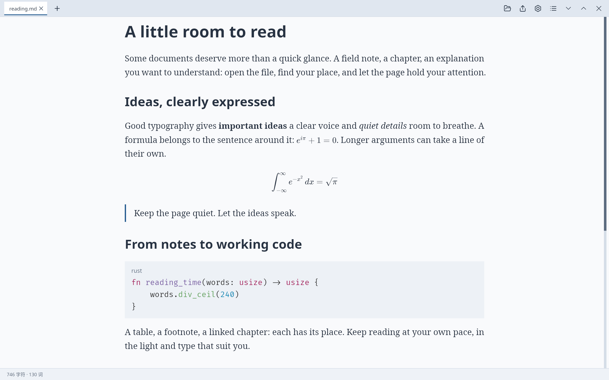
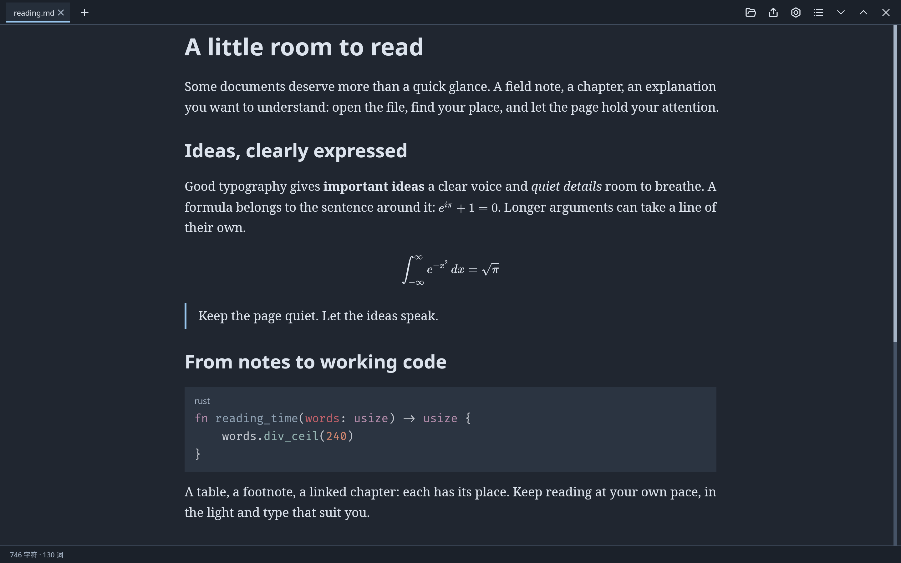
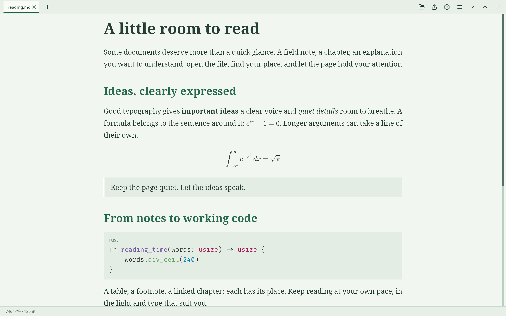
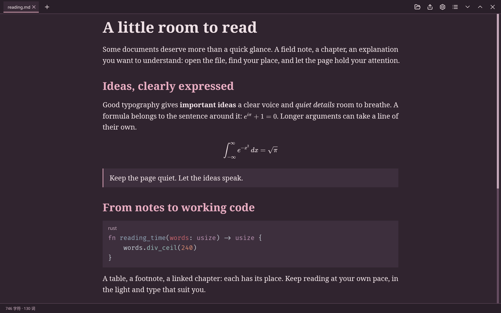
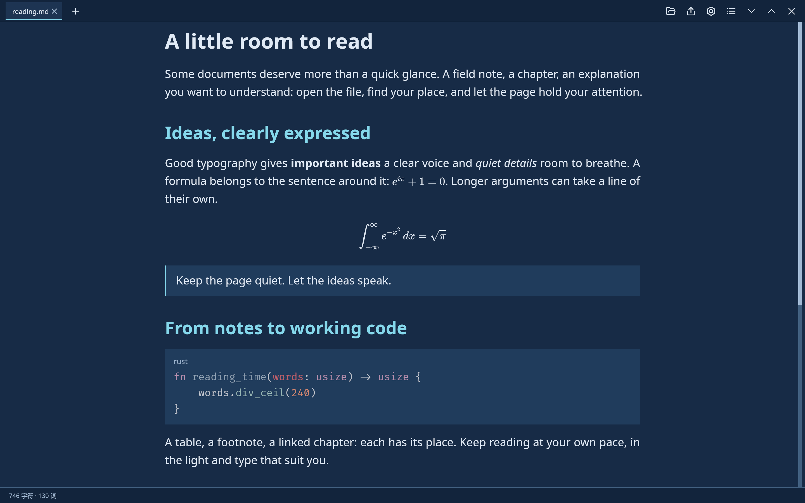
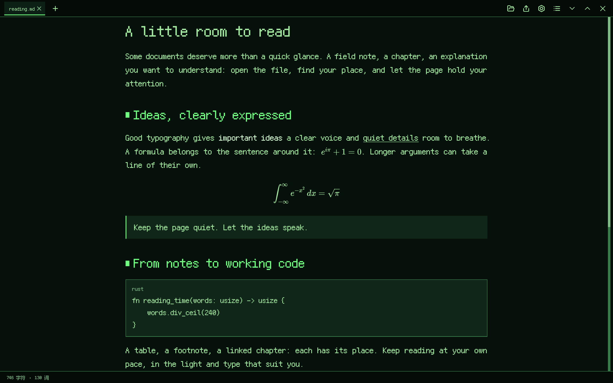

# Reader themes / 阅读主题

[User guides](README.md) · [MVSS theme guide](stylesheets.md)

Each view below shows the same document in a bundled reader theme, including
its own fonts, spacing and colors. Open **Settings → Styles** to select a theme
on desktop or Android. See [fonts](fonts.md) to download the declared families.

下面分别展示同一篇文档在六种内置阅读主题下的完整页面，保留各自的字体、间距与配色。
桌面与 Android 都可以在**设置 → 样式**中选择主题；主题所需字体可以在[字体页面](fonts.md)下载。
每张图后附有中文示例入口。

## Light

A clear, light reading surface. 清爽的浅色阅读界面。

[中文示例](../screenshots/readme/zh-light.png)

## Dark

A quiet, dark reading surface. 沉静的暗色阅读界面。

[中文示例](../screenshots/readme/zh-dark.png)

## Celadon

Soft greens and serif type. 柔和的青瓷绿与衬线字体。

[中文示例](../screenshots/readme/zh-celadon.png)

## Rosewood

Warm accents on a dark page. 暗色页面上的温暖点缀。

[中文示例](../screenshots/readme/zh-rosewood.png)

## Blueprint

Blue tones for technical notes. 适合技术笔记的蓝色调。

[中文示例](../screenshots/readme/zh-blueprint.png)

## 8-bit

Pixel type and green accents. 像素字体与绿色点缀。

[中文示例](../screenshots/readme/zh-8-bit.png)

For your own palette or typography, see the [MVSS theme guide](stylesheets.md).
想定制配色或排版，可以从 [MVSS 主题指南](stylesheets.md)开始。
