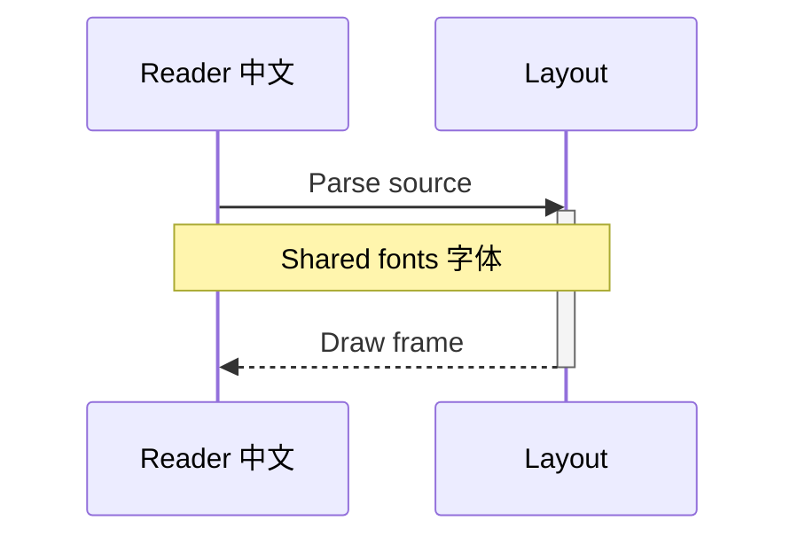

# Sequence 时序

```mermaid
sequenceDiagram
  participant A as Reader 中文
  participant B as Layout
  A->>B: Parse source
  activate B
  Note over A,B: Shared fonts 字体
  B-->>A: Draw frame
  deactivate B
```
